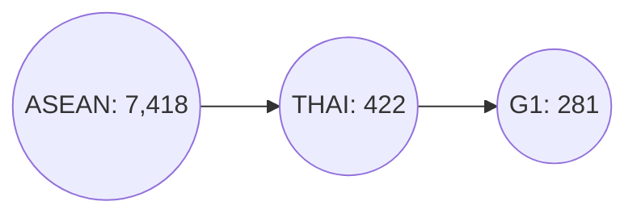
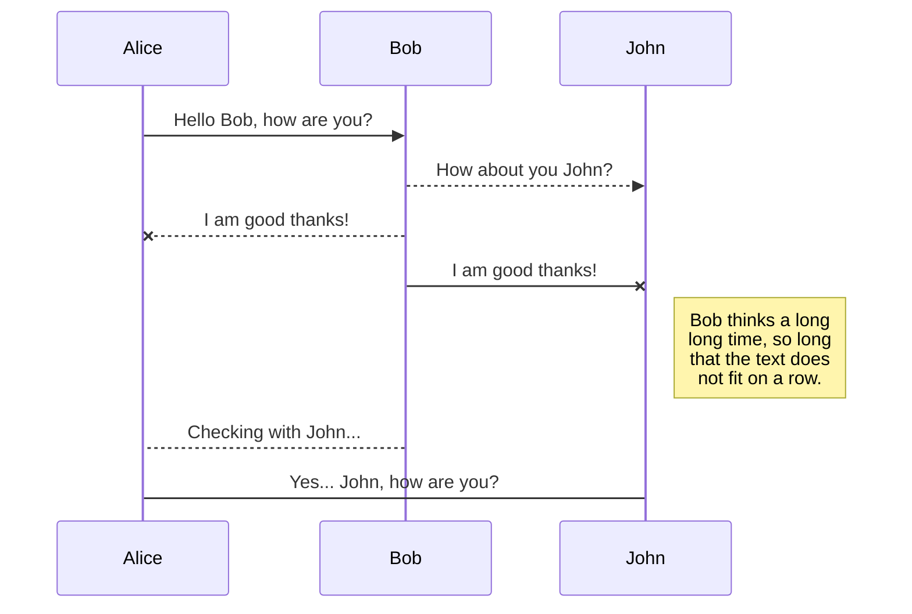
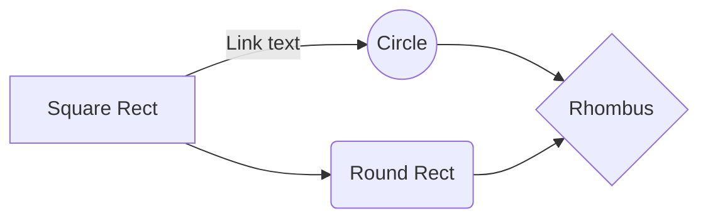

# รายงานสรุปการดำเนินการข้อสอบ Proof of Concept (POC) ตำแหน่ง นักวิทยาศาสตร์ข้อมูล
**รหัสผู้เข้าสอบ : PSU-057870 นายไตรรัตน์ อารมฤทธิ์**

## รายละเอียดของรายงาน
รายงานประกอบด้วยข้อมูลทั้งหมด 2 ส่วน ดังนี้
 - **ส่วนที่ 1** : การวิเคราะห์ภูมิทัศน์งานวิจัยเชิงเปรียบเทียบของการแข่งขันด้านงานวิจัยของมหาวิทยาลัยชั้นนำในประเทศไทย
 - **ส่วนที่ 2** : การพัฒนาแบบจำลอง (Model) เพื่อทำนาย "ศักยภาพในการสร้างผลกระทบของบทความวิจัย" 

###  1. การวิเคราะห์ภูมิทัศน์งานวิจัยเชิงเปรียบเทียบของการแข่งขันด้านงานวิจัยของมหาวิทยาลัยชั้นนำในประเทศไทย

ขั้นตอนดำเนินการ ดังนี้

 1. ทำการศึกษารายละเอียดโครงสร้าง Metadata จากข้อมูลบนฐาน ArXiv ซึ่งมีรายละเอียดของผลงานวิจัยที่ใช้สำหรับการดำเนินการ
 2. ระบุปัญหาที่พบในการศึกษาโครงสร้าง Metadata จากข้อมูลบนฐาน ArXiv 
	> **ปัญหาที่พบ :** การขาดข้อมูลที่เกี่ยวข้องกับผู้แต่งบทความ (Author) ซึ่งเป็นสิ่งที่สำคัญต่อการระบุ **หน่วยงานที่เกี่ยวข้องกับบทความวิจัย** และ **การอ้างอิงบทความวิจัย**ซึ่งจำเป็นต้องใช้ในการวิเคราะห์ครั้งนี้ 
	
	**วิธีแก้ไขปัญหาที่ได้ทดลอง**
	1.	**การดึงข้อมูลจากไฟล์ PDF** ที่มีอยู่บนฐาน ด้วยการทำ OCR ผ่าน Large Language Model (LLM) เนื่องจากบนความมีรูปแบบการเขียนที่แตกต่างกัน การใช้ LLM จึงมีประโยชน์ในการรับมือความแตกต่างที่เกิดขึ้น 
	2. **การดึงข้อมูลจาก third-party Databased  (OpenAlex)** เนื่องจากเป็นฐานข้อมูลที่มีความร่วมมือกับ Cornell university ที่เป็นผู้ดูแลฐานข้อมูล ArXiv และเมื่อเช็คจำนวนบทความที่อยู่บนฐานทั้งคู่นั้นมีปริมาณที่ใกล้เคียงกัน และนอกจากนั้นยังมีข้อมูลอ้างอิงบทความวิจัย ซึ่งจำเป็นต่อการวิเคราะห์ข้อมูลในส่วนที่ 2
	
	ดังนั้น จากกระบวนการทั้ง 2 ทางผู้สอบได้เลือก **ใช้วิธีการดึงข้อมูลจาก OpenAlex** เนื่องจากระยะเวลาที่กำหนดค่อนข้างสั้น ทำให้การดำเนินการ OCR จากบทความทั้งหมด ถึงแม้จะกรองให้เหลือตามที่โจทย์กำหนดแล้วก็ตาม

3. **กระบวนการดึงข้อมูลผ่าน API ของฐานข้อมูล OpenAlex** ทางผู้สอบได้ดำเนินการดึงข้อมูลโดยการเลือกบทความบนฐาน ArXiv ผ่าน Source และ กำหนดให้ดึงข้อมูลของกลุ่มประเทศเอเชียตะวันออกเฉียงใต้ (ASEAN)  โดยทำการตรวจสอบความครบถ้วนดังนี้

ซึ่งจำนวนดังกล่าวเป็นจำนวนที่ถูกต้องเมื่อเราทำการสืบค้นข้อมูลโดยใช้เงื่อนไข Source ร่วมกับ Institution ID ดังนั้น ทางผู้สอบจึงทำการดึงข้อมูลจากฐาน OpenAlex ทั้งหมด 7418 ผลงาน และ ทำการ Merge กับชุดข้อมูลตามที่โจทย์กำหนด `arxiv-metadata-oai-snapshot.json` ผ่าน work_id หรือเลขประจำบทความบนฐาน ArXiv

 4. **กระบวนการออกแบบโครงสร้างข้อมูล (DataModel)** โดยในการสอบครั้งนี้ทางผู้เข้าสอบได้มีการแบ่งข้อมูลออกเป็น 2 รูปแบบโครงสร้างข้อมูล คือ 
	1. ข้อมูลที่เน้นเฉพาะข้อมูลที่เกี่ยวข้องกับบทความเท่านั้น (Article_DB)
	2. ข้อมูลที่เน้นเชื่อมโยงข้อมูลที่เกี่ยวข้องกับผู้แต่งบทความ (Author_DB) 

ซึ่งทั้ง 2 โครงสร้างข้อมูลจะถูกนำไปใช้ในการวิเคราะห์ภูมิทัศน์งานวิจัยเชิงเปรียบเทียบของการแข่งขันด้านงานวิจัยของมหาวิทยาลัยชั้นนำในประเทศไทย ดังนี้
	 
 ### โจทย์วิเคราะห์ที่ 1 : เปรียบเทียบจำนวนผลงานตีพิมพ์ในแต่ละปีของมหาวิทยาลัยกลุ่มที่ 1 กลุ่มพัฒนาการวิจัยระดับแนวหน้าของโลก

 1. จากการดึงข้อมูลทั้งหมด พบว่า มหาวิทยาลัยกลุ่มที่ 1 ทั้ง 17 มหาวิทยาลัย ล้วนมีการตีพิมพ์ผลงานวิจัยในฐานข้อมูลทั้งสิ้น แต่เนื่องจากบางมหาวิทยาลัยมีจำนวนที่น้อยทำให้การวิเคราะห์ไม่สามารถให้ผลลัพธ์ที่ชัดเจน ดังนั้น ผู้สอบจึงทำการคัดเลือกมหาวิทยาลัยจำนวน 5 แห่ง ประกอบด้วย `จุฬาลงกรณ์มหาวิทยาลัย` `มหาวิทยาลัยมหิดล` `มหาวิทยาลัยสงขลานครินทร์` `มหาวิทยาลัยเทคโนโลยีพระจอมเกล้าธนบุรี` และ `มหาวิทยาลัยเชียงใหม่` ซึ่งทางผู้สอบได้ดำเนินการสร้าง Visulization ในรูปแบบของ GroupBar Chart และ Faceted Bar chart เพื่อแสดงข้อมูลเปรียบเทียบของทั้ง 5 มหาวิทยาลัยในแต่ละปีที่มีการตีพิมพ์ ดังภาพที่ 1-2

**ข้อมูลเชิงลึก (Insight) :** จากกราฟภาพรวมชี้ให้เห็นว่าผลงานตีพิมพ์ของกลุ่มมหาวิทยาลัยวิจัยชั้นนำมีความ **"ผันผวนสูง"** และ **"ไม่มีผู้นำที่ครองตลาดอย่างถาวร"** แต่ละมหาวิทยาลัยมีความโดดเด่นขึ้นมาเป็นช่วงๆ สะท้อนให้เห็นถึงความสำเร็จของโครงการวิจัยเฉพาะทางหรือเป็นรอบๆ มากกว่าการเติบโตอย่างต่อเนื่องและยั่งยืน กลยุทธ์ในอนาคตจึงควรพิจารณาแนวทางสร้างความสม่ำเสมอและต่อยอดจากความสำเร็จที่เกิดขึ้นเป็นครั้งคราว แต่ในมุมมองของมหาวิทยาลัยสงขลานครินทร์ ถือว่า ยังมีงานวิจัยในฐาน ArXiv ที่น้อย ซึ่งถือเป็นเรื่องสามารถเข้าใจได้ว่านักวิจัยอาจจะมุ่งเน้นในการตีพิมพ์ผลงานบนฐานข้อมูล Scopus และ Web of Science ที่มีการจัดอันดับ และได้รับการยอมรับของทีมบริหารของมหาวิทยาลัยมากกว่า

 ### โจทย์วิเคราะห์ที่ 2 : วิเคราะห์และแสดงภาพเปรียบเทียบหมวดหมู่งานวิจัย (Categories) ที่แต่ละมหาวิทยาลัยให้ความสำคัญ

**ข้อมูลเชิงลึก (Insight) :** จากกราฟแสดงให้เห็น **อัตลักษณ์และความเชี่ยวชาญ** ที่แตกต่างกันอย่างชัดเจนของแต่ละมหาวิทยาลัย เราสามารถแบ่งมหาวิทยาลัยออกเป็น 2 กลุ่มหลัก คือ **กลุ่มเชี่ยวชาญเฉพาะทาง (Specialists)** ที่มีความเป็นเลิศในสาขาใดสาขาหนึ่งอย่างเด่นชัด และ **กลุ่มครอบคลุมหลากหลาย (Comprehensive)** ที่มีผลงานวิจัยในวงกว้าง แต่โดยรวมแล้วเราจะเห็นได้ว่าสาขาวิชาที่มักได้รับการตีพิมพ์บนฐาน ArXiv จะเป็นสาขาที่มีการเปลี่ยนแปลงขององค์ความรู้ที่รวดเร็ว มีการแข่งขันสูง และ มีความต้องการที่จะแลกเปลี่ยนข้อค้นพบที่รวดเร็วเพียงพอ เช่น สาขาวิทยาการคอมพิวเตอร์ (Computer Science) , สาขาฟิสิกส์และดาราศาสตร์ เป็นต้น

นอกจากการวิเคราะห์หมวดหมู่งานวิจัย หรือ สาขาวิชา (Subject Area) ทางผู้สอบได้ดำเนินการประยุกต์ใช้หลักการทางด้านเศรษฐศาสตร์ คือ `Economic Complexity Index` หรือ `ดัชนีความซับซ้อนทางเศรษฐกิจ (ECI)` เข้ามาประยุกต์ใช้ในการวิเคราะห์ข้อมูลเชิงลึกของมหาวิทยาลัย และ หัวข้อวิจัยที่มีความเชี่ยวชาญของแต่ละมหาวิทยาลัย โดยรายละเอียดมีดังนี้

# **Economic Complexity Index (Research) Analysis**

## **คำจำกัดความ (Definition)**

> **ดัชนีความซับซ้อนทางเศรษฐกิจ (Economic Complexity Index: ECI)**  
> ในบริบทของการวิจัย เป็นตัวชี้วัดที่ใช้ประเมิน **ขีดความสามารถและความซับซ้อนของสถาบันวิจัย**  
> โดยอาศัยแนวคิดจากดัชนีความซับซ้อนทางเศรษฐกิจในภาคการค้า มาประยุกต์ใช้กับผลงานวิจัย

โดยหลักการ ECI ประกอบด้วย:
1. **ความหลากหลาย (Diversity):** จำนวนหัวข้องานวิจัยที่สถาบันมีผลงานตีพิมพ์  
2. **ความแพร่หลาย (Ubiquity):** ระดับความเฉพาะทางหรือความหายากของแต่ละหัวข้อเมื่อเทียบกับสถาบันอื่น  

สถาบันที่มีการตีพิมพ์ในหัวข้อที่มีความเฉพาะทางสูงและหลากหลาย  
จะมีค่า **ECI สูงกว่า** ซึ่งสะท้อนถึงความสามารถในการทำวิจัยที่ซับซ้อนและมีคุณภาพสูง  

---

## **การตีความ (Interpretation)**

- **ค่า ECI สูง:**  
  - สะท้อนว่าสถาบันมีความสามารถในการทำวิจัยใน **หัวข้อที่หลากหลายและเฉพาะทางสูง**  
  - บ่งชี้ถึงศักยภาพในการผลิตผลงานวิจัยที่ **ซับซ้อนและมีผลกระทบสูง**  
  - *ตัวอย่าง:* มหาวิทยาลัยที่มีผลงานในด้าน AI เชิงลึก ควอนตัมคอมพิวติ้ง และวัสดุศาสตร์ขั้นสูง จะมีค่า ECI สูง  

- **ค่า ECI ต่ำ:**  
  - สะท้อนว่าสถาบันมีความเชี่ยวชาญใน **หัวข้อจำกัดหรือหัวข้อที่แพร่หลายทั่วไป**  
  - งานวิจัยมีแนวโน้มที่จะ **ไม่ซับซ้อนมากนักหรืออยู่ในระดับพื้นฐาน**  
  - *ตัวอย่าง:* มหาวิทยาลัยที่ตีพิมพ์เฉพาะในหัวข้อทั่วไป จะมีค่า ECI ต่ำกว่า  

---

## **สรุปตาราง (Summary Table)**

| ตัวชี้วัด (Metric) | ความหมาย (Meaning) |
|--------------------|--------------------|
| **ECI (สูง)** | สถาบันผลิตงานวิจัยในหัวข้อที่หลากหลายและเฉพาะทางสูง สะท้อนถึงศักยภาพการวิจัยขั้นสูง |
| **ECI (ต่ำ)** | สถาบันมุ่งเน้นในหัวข้อจำกัดหรือหัวข้อทั่วไป สะท้อนถึงความซับซ้อนของงานวิจัยที่ต่ำกว่า |

## **ตารางแสดงค่าดัชนีความซับซ้อนทางเศรษฐกิจของสถาบันวิจัย (ECI Rankings)**

| ลำดับ | สถาบัน (Institution) | ค่า ECI |
|:------:|------------------------|:-------:|
| 1 | Mahidol University | 0.745844 |
| 2 | Chulalongkorn University | 0.573940 |
| 3 | Chiang Mai University | 0.510819 |
| 4 | Silpakorn University | 0.490107 |
| 5 | King Mongkut's University of Technology Thonburi | 0.453606 |
| 6 | Suranaree University of Technology | 0.432759 |
| 7 | Walailak University | 0.430088 |
| 8 | Naresuan University | 0.346462 |
| 9 | Khon Kaen University | 0.330760 |
| 10 | Thammasat University | 0.254533 |
| 11 | Prince of Songkla University | 0.222884 |
| 12 | Kasetsart University | -0.149227 |
| 13 | Vidyasirimedhi Institute of Science and Technology | -0.498426 |
| 14 | National Institute of Development Administration | -0.881784 |
| 15 | Mahasarakham University | -3.262363 |

จากตาราง **ดัชนีความซับซ้อนทางเศรษฐกิจของสถาบันวิจัย (Economic Complexity Index: ECI)** ซึ่งสะท้อนถึง **ขีดความสามารถ ความหลากหลาย และความเชี่ยวชาญเชิงลึกของงานวิจัย** ของแต่ละสถาบัน พบว่า **มหาวิทยาลัยสงขลานครินทร์ (PSU)** มีค่า **ECI = 0.222884** จัดอยู่ใน **อันดับที่ 11 จาก 15 สถาบัน**  

### 🔍 **การตีความผลลัพธ์**
- ค่า ECI บ่งบอกถึง **ความซับซ้อนขององค์ความรู้และความสามารถของสถาบัน**  
  ซึ่งวัดจากความหลากหลายของหัวข้องานวิจัย และระดับความเฉพาะทางของแต่ละหัวข้อ  
- PSU มีค่า ECI อยู่ในระดับ **ปานกลางค่อนไปทางต่ำ** เมื่อเทียบกับมหาวิทยาลัยชั้นนำของประเทศ เช่น  
  **Mahidol University, Chulalongkorn University, และ Chiang Mai University** ที่มีค่า ECI สูงกว่า  

### 💡 **ข้อเสนอเชิงกลยุทธ์**
1. **ขยายความเชี่ยวชาญในหัวข้อเฉพาะทาง (Niche Areas)** เพื่อสร้างความโดดเด่นในด้านที่สอดคล้องกับจุดแข็งของภาคใต้ เช่น นวัตกรรมสุขภาพและเทคโนโลยีชีวภาพ พลังงานสะอาดและความยั่งยืน เทคโนโลยีทางทะเลและสิ่งแวดล้อมชายฝั่ง  

2. **ส่งเสริมการบูรณาการสหสาขา (Interdisciplinary Research)**  เพื่อเพิ่มความซับซ้อนและคุณค่าทางวิชาการของงานวิจัย PSU  

3. **สร้างเครือข่ายความร่วมมือเชิงลึก (Research Network Expansion)** กับสถาบันที่มี ECI สูง เพื่อยกระดับคุณภาพและขีดความสามารถในการแข่งขันระดับประเทศ  

## Create files and folders

The file explorer is accessible using the button in left corner of the navigation bar. You can create a new file by clicking the **New file** button in the file explorer. You can also create folders by clicking the **New folder** button.

## Switch to another file

All your files and folders are presented as a tree in the file explorer. You can switch from one to another by clicking a file in the tree.

## Rename a file

You can rename the current file by clicking the file name in the navigation bar or by clicking the **Rename** button in the file explorer.

## Delete a file

You can delete the current file by clicking the **Remove** button in the file explorer. The file will be moved into the **Trash** folder and automatically deleted after 7 days of inactivity.

## Export a file

You can export the current file by clicking **Export to disk** in the menu. You can choose to export the file as plain Markdown, as HTML using a Handlebars template or as a PDF.

# Synchronization

Synchronization is one of the biggest features of StackEdit. It enables you to synchronize any file in your workspace with other files stored in your **Google Drive**, your **Dropbox** and your **GitHub** accounts. This allows you to keep writing on other devices, collaborate with people you share the file with, integrate easily into your workflow... The synchronization mechanism takes place every minute in the background, downloading, merging, and uploading file modifications.

There are two types of synchronization and they can complement each other:

- The workspace synchronization will sync all your files, folders and settings automatically. This will allow you to fetch your workspace on any other device.
	> To start syncing your workspace, just sign in with Google in the menu.

- The file synchronization will keep one file of the workspace synced with one or multiple files in **Google Drive**, **Dropbox** or **GitHub**.
	> Before starting to sync files, you must link an account in the **Synchronize** sub-menu.

## Open a file

You can open a file from **Google Drive**, **Dropbox** or **GitHub** by opening the **Synchronize** sub-menu and clicking **Open from**. Once opened in the workspace, any modification in the file will be automatically synced.

## Save a file

You can save any file of the workspace to **Google Drive**, **Dropbox** or **GitHub** by opening the **Synchronize** sub-menu and clicking **Save on**. Even if a file in the workspace is already synced, you can save it to another location. StackEdit can sync one file with multiple locations and accounts.

## Synchronize a file

Once your file is linked to a synchronized location, StackEdit will periodically synchronize it by downloading/uploading any modification. A merge will be performed if necessary and conflicts will be resolved.

If you just have modified your file and you want to force syncing, click the **Synchronize now** button in the navigation bar.

> **Note:** The **Synchronize now** button is disabled if you have no file to synchronize.

## Manage file synchronization

Since one file can be synced with multiple locations, you can list and manage synchronized locations by clicking **File synchronization** in the **Synchronize** sub-menu. This allows you to list and remove synchronized locations that are linked to your file.

# Publication

Publishing in StackEdit makes it simple for you to publish online your files. Once you're happy with a file, you can publish it to different hosting platforms like **Blogger**, **Dropbox**, **Gist**, **GitHub**, **Google Drive**, **WordPress** and **Zendesk**. With [Handlebars templates](http://handlebarsjs.com/), you have full control over what you export.

> Before starting to publish, you must link an account in the **Publish** sub-menu.

## Publish a File

You can publish your file by opening the **Publish** sub-menu and by clicking **Publish to**. For some locations, you can choose between the following formats:

- Markdown: publish the Markdown text on a website that can interpret it (**GitHub** for instance),
- HTML: publish the file converted to HTML via a Handlebars template (on a blog for example).

## Update a publication

After publishing, StackEdit keeps your file linked to that publication which makes it easy for you to re-publish it. Once you have modified your file and you want to update your publication, click on the **Publish now** button in the navigation bar.

> **Note:** The **Publish now** button is disabled if your file has not been published yet.

## Manage file publication

Since one file can be published to multiple locations, you can list and manage publish locations by clicking **File publication** in the **Publish** sub-menu. This allows you to list and remove publication locations that are linked to your file.

# Markdown extensions

StackEdit extends the standard Markdown syntax by adding extra **Markdown extensions**, providing you with some nice features.

> **ProTip:** You can disable any **Markdown extension** in the **File properties** dialog.

## SmartyPants

SmartyPants converts ASCII punctuation characters into "smart" typographic punctuation HTML entities. For example:

|                |ASCII                          |HTML                         |
|----------------|-------------------------------|-----------------------------|
|Single backticks|`'Isn't this fun?'`            |'Isn't this fun?'            |
|Quotes          |`"Isn't this fun?"`            |"Isn't this fun?"            |
|Dashes          |`-- is en-dash, --- is em-dash`|-- is en-dash, --- is em-dash|

## KaTeX

You can render LaTeX mathematical expressions using [KaTeX](https://khan.github.io/KaTeX/):

The *Gamma function* satisfying $\Gamma(n) = (n-1)!\quad\forall n\in\mathbb N$ is via the Euler integral

$$
\Gamma(z) = \int_0^\infty t^{z-1}e^{-t}dt\,.
$$

> You can find more information about **LaTeX** mathematical expressions [here](http://meta.math.stackexchange.com/questions/5020/mathjax-basic-tutorial-and-quick-reference).

## UML diagrams

You can render UML diagrams using [Mermaid](https://mermaidjs.github.io/). For example, this will produce a sequence diagram:

And this will produce a flow chart:

