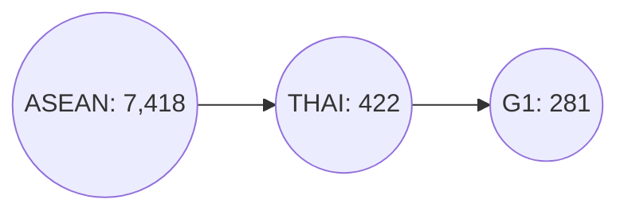

# รายงานสรุปการดำเนินการข้อสอบ Proof of Concept (POC) ตำแหน่ง นักวิทยาศาสตร์ข้อมูล
**รหัสผู้เข้าสอบ : PSU-057870 นายไตรรัตน์ อารมฤทธิ์**

## รายละเอียดของรายงาน
รายงานประกอบด้วยข้อมูลทั้งหมด 2 ส่วน ดังนี้
 - **ส่วนที่ 1** : การวิเคราะห์ภูมิทัศน์งานวิจัยเชิงเปรียบเทียบของการแข่งขันด้านงานวิจัยของมหาวิทยาลัยชั้นนำในประเทศไทย
 - **ส่วนที่ 2** : การพัฒนาแบบจำลอง (Model) เพื่อทำนาย "ศักยภาพในการสร้างผลกระทบของบทความวิจัย" 

###  1. การวิเคราะห์ภูมิทัศน์งานวิจัยเชิงเปรียบเทียบของการแข่งขันด้านงานวิจัยของมหาวิทยาลัยชั้นนำในประเทศไทย

ขั้นตอนดำเนินการ ดังนี้

 1. ทำการศึกษารายละเอียดโครงสร้าง Metadata จากข้อมูลบนฐาน ArXiv ซึ่งมีรายละเอียดของผลงานวิจัยที่ใช้สำหรับการดำเนินการ
 2. ระบุปัญหาที่พบในการศึกษาโครงสร้าง Metadata จากข้อมูลบนฐาน ArXiv 
	> **ปัญหาที่พบ :** การขาดข้อมูลที่เกี่ยวข้องกับผู้แต่งบทความ (Author) ซึ่งเป็นสิ่งที่สำคัญต่อการระบุ **หน่วยงานที่เกี่ยวข้องกับบทความวิจัย** และ **การอ้างอิงบทความวิจัย**ซึ่งจำเป็นต้องใช้ในการวิเคราะห์ครั้งนี้ 
	
	**วิธีแก้ไขปัญหาที่ได้ทดลอง**
	1.	**การดึงข้อมูลจากไฟล์ PDF** ที่มีอยู่บนฐาน ด้วยการทำ OCR ผ่าน Large Language Model (LLM) เนื่องจากบนความมีรูปแบบการเขียนที่แตกต่างกัน การใช้ LLM จึงมีประโยชน์ในการรับมือความแตกต่างที่เกิดขึ้น 
	2. **การดึงข้อมูลจาก third-party Databased  (OpenAlex)** เนื่องจากเป็นฐานข้อมูลที่มีความร่วมมือกับ Cornell university ที่เป็นผู้ดูแลฐานข้อมูล ArXiv และเมื่อเช็คจำนวนบทความที่อยู่บนฐานทั้งคู่นั้นมีปริมาณที่ใกล้เคียงกัน และนอกจากนั้นยังมีข้อมูลอ้างอิงบทความวิจัย ซึ่งจำเป็นต่อการวิเคราะห์ข้อมูลในส่วนที่ 2
	
	ดังนั้น จากกระบวนการทั้ง 2 ทางผู้สอบได้เลือก **ใช้วิธีการดึงข้อมูลจาก OpenAlex** เนื่องจากระยะเวลาที่กำหนดค่อนข้างสั้น ทำให้การดำเนินการ OCR จากบทความทั้งหมด ถึงแม้จะกรองให้เหลือตามที่โจทย์กำหนดแล้วก็ตาม

3. **กระบวนการดึงข้อมูลผ่าน API ของฐานข้อมูล OpenAlex** ทางผู้สอบได้ดำเนินการดึงข้อมูลโดยการเลือกบทความบนฐาน ArXiv ผ่าน Source และ กำหนดให้ดึงข้อมูลของกลุ่มประเทศเอเชียตะวันออกเฉียงใต้ (ASEAN)  โดยทำการตรวจสอบความครบถ้วนดังนี้

ซึ่งจำนวนดังกล่าวเป็นจำนวนที่ถูกต้องเมื่อเราทำการสืบค้นข้อมูลโดยใช้เงื่อนไข Source ร่วมกับ Institution ID ดังนั้น ทางผู้สอบจึงทำการดึงข้อมูลจากฐาน OpenAlex ทั้งหมด 7418 ผลงาน และ ทำการ Merge กับชุดข้อมูลตามที่โจทย์กำหนด `arxiv-metadata-oai-snapshot.json` ผ่าน work_id หรือเลขประจำบทความบนฐาน ArXiv

 4. **กระบวนการออกแบบโครงสร้างข้อมูล (DataModel)** โดยในการสอบครั้งนี้ทางผู้เข้าสอบได้มีการแบ่งข้อมูลออกเป็น 2 รูปแบบโครงสร้างข้อมูล คือ 
	1. ข้อมูลที่เน้นเฉพาะข้อมูลที่เกี่ยวข้องกับบทความเท่านั้น (Article_DB)
	2. ข้อมูลที่เน้นเชื่อมโยงข้อมูลที่เกี่ยวข้องกับผู้แต่งบทความ (Author_DB) 

ซึ่งทั้ง 2 โครงสร้างข้อมูลจะถูกนำไปใช้ในการวิเคราะห์ภูมิทัศน์งานวิจัยเชิงเปรียบเทียบของการแข่งขันด้านงานวิจัยของมหาวิทยาลัยชั้นนำในประเทศไทย ดังนี้
	 
 ### โจทย์วิเคราะห์ที่ 1 : เปรียบเทียบจำนวนผลงานตีพิมพ์ในแต่ละปีของมหาวิทยาลัยกลุ่มที่ 1 กลุ่มพัฒนาการวิจัยระดับแนวหน้าของโลก

 1. จากการดึงข้อมูลทั้งหมด พบว่า มหาวิทยาลัยกลุ่มที่ 1 ทั้ง 17 มหาวิทยาลัย ล้วนมีการตีพิมพ์ผลงานวิจัยในฐานข้อมูลทั้งสิ้น แต่เนื่องจากบางมหาวิทยาลัยมีจำนวนที่น้อยทำให้การวิเคราะห์ไม่สามารถให้ผลลัพธ์ที่ชัดเจน ดังนั้น ผู้สอบจึงทำการคัดเลือกมหาวิทยาลัยจำนวน 5 แห่ง ประกอบด้วย `จุฬาลงกรณ์มหาวิทยาลัย` `มหาวิทยาลัยมหิดล` `มหาวิทยาลัยสงขลานครินทร์` `มหาวิทยาลัยเทคโนโลยีพระจอมเกล้าธนบุรี` และ `มหาวิทยาลัยเชียงใหม่` ซึ่งทางผู้สอบได้ดำเนินการสร้าง Visulization ในรูปแบบของ GroupBar Chart และ Faceted Bar chart เพื่อแสดงข้อมูลเปรียบเทียบของทั้ง 5 มหาวิทยาลัยในแต่ละปีที่มีการตีพิมพ์ ดังภาพที่ 1-2

**ข้อมูลเชิงลึก (Insight) :** จากกราฟภาพรวมชี้ให้เห็นว่าผลงานตีพิมพ์ของกลุ่มมหาวิทยาลัยวิจัยชั้นนำมีความ **"ผันผวนสูง"** และ **"ไม่มีผู้นำที่ครองตลาดอย่างถาวร"** แต่ละมหาวิทยาลัยมีความโดดเด่นขึ้นมาเป็นช่วงๆ สะท้อนให้เห็นถึงความสำเร็จของโครงการวิจัยเฉพาะทางหรือเป็นรอบๆ มากกว่าการเติบโตอย่างต่อเนื่องและยั่งยืน กลยุทธ์ในอนาคตจึงควรพิจารณาแนวทางสร้างความสม่ำเสมอและต่อยอดจากความสำเร็จที่เกิดขึ้นเป็นครั้งคราว แต่ในมุมมองของมหาวิทยาลัยสงขลานครินทร์ ถือว่า ยังมีงานวิจัยในฐาน ArXiv ที่น้อย ซึ่งถือเป็นเรื่องสามารถเข้าใจได้ว่านักวิจัยอาจจะมุ่งเน้นในการตีพิมพ์ผลงานบนฐานข้อมูล Scopus และ Web of Science ที่มีการจัดอันดับ และได้รับการยอมรับของทีมบริหารของมหาวิทยาลัยมากกว่า

 ### โจทย์วิเคราะห์ที่ 2 : วิเคราะห์และแสดงภาพเปรียบเทียบหมวดหมู่งานวิจัย (Categories) ที่แต่ละมหาวิทยาลัยให้ความสำคัญ

**ข้อมูลเชิงลึก (Insight) :** จากกราฟแสดงให้เห็น **อัตลักษณ์และความเชี่ยวชาญ** ที่แตกต่างกันอย่างชัดเจนของแต่ละมหาวิทยาลัย เราสามารถแบ่งมหาวิทยาลัยออกเป็น 2 กลุ่มหลัก คือ **กลุ่มเชี่ยวชาญเฉพาะทาง (Specialists)** ที่มีความเป็นเลิศในสาขาใดสาขาหนึ่งอย่างเด่นชัด และ **กลุ่มครอบคลุมหลากหลาย (Comprehensive)** ที่มีผลงานวิจัยในวงกว้าง แต่โดยรวมแล้วเราจะเห็นได้ว่าสาขาวิชาที่มักได้รับการตีพิมพ์บนฐาน ArXiv จะเป็นสาขาที่มีการเปลี่ยนแปลงขององค์ความรู้ที่รวดเร็ว มีการแข่งขันสูง และ มีความต้องการที่จะแลกเปลี่ยนข้อค้นพบที่รวดเร็วเพียงพอ เช่น สาขาวิทยาการคอมพิวเตอร์ (Computer Science) , สาขาฟิสิกส์และดาราศาสตร์ เป็นต้น

นอกจากการวิเคราะห์หมวดหมู่งานวิจัย หรือ สาขาวิชา (Subject Area) ทางผู้สอบได้ดำเนินการประยุกต์ใช้หลักการทางด้านเศรษฐศาสตร์ คือ `Economic Complexity Index` หรือ `ดัชนีความซับซ้อนทางเศรษฐกิจ (ECI)` เข้ามาประยุกต์ใช้ในการวิเคราะห์ข้อมูลเชิงลึกของมหาวิทยาลัย และ หัวข้อวิจัยที่มีความเชี่ยวชาญของแต่ละมหาวิทยาลัย โดยรายละเอียดมีดังนี้

# **Economic Complexity Index (Research) Analysis**

## **คำจำกัดความ (Definition)**

> **ดัชนีความซับซ้อนทางเศรษฐกิจ (Economic Complexity Index: ECI)**  
> ในบริบทของการวิจัย เป็นตัวชี้วัดที่ใช้ประเมิน **ขีดความสามารถและความซับซ้อนของสถาบันวิจัย**  
> โดยอาศัยแนวคิดจากดัชนีความซับซ้อนทางเศรษฐกิจในภาคการค้า มาประยุกต์ใช้กับผลงานวิจัย

โดยหลักการ ECI ประกอบด้วย:
1. **ความหลากหลาย (Diversity):** จำนวนหัวข้องานวิจัยที่สถาบันมีผลงานตีพิมพ์  
2. **ความแพร่หลาย (Ubiquity):** ระดับความเฉพาะทางหรือความหายากของแต่ละหัวข้อเมื่อเทียบกับสถาบันอื่น  

สถาบันที่มีการตีพิมพ์ในหัวข้อที่มีความเฉพาะทางสูงและหลากหลาย  
จะมีค่า **ECI สูงกว่า** ซึ่งสะท้อนถึงความสามารถในการทำวิจัยที่ซับซ้อนและมีคุณภาพสูง  

---

## **การตีความ (Interpretation)**

- **ค่า ECI สูง:**  
  - สะท้อนว่าสถาบันมีความสามารถในการทำวิจัยใน **หัวข้อที่หลากหลายและเฉพาะทางสูง**  
  - บ่งชี้ถึงศักยภาพในการผลิตผลงานวิจัยที่ **ซับซ้อนและมีผลกระทบสูง**  
  - *ตัวอย่าง:* มหาวิทยาลัยที่มีผลงานในด้าน AI เชิงลึก ควอนตัมคอมพิวติ้ง และวัสดุศาสตร์ขั้นสูง จะมีค่า ECI สูง  

- **ค่า ECI ต่ำ:**  
  - สะท้อนว่าสถาบันมีความเชี่ยวชาญใน **หัวข้อจำกัดหรือหัวข้อที่แพร่หลายทั่วไป**  
  - งานวิจัยมีแนวโน้มที่จะ **ไม่ซับซ้อนมากนักหรืออยู่ในระดับพื้นฐาน**  
  - *ตัวอย่าง:* มหาวิทยาลัยที่ตีพิมพ์เฉพาะในหัวข้อทั่วไป จะมีค่า ECI ต่ำกว่า  

---

## **สรุปตาราง (Summary Table)**

| ตัวชี้วัด (Metric) | ความหมาย (Meaning) |
|--------------------|--------------------|
| **ECI (สูง)** | สถาบันผลิตงานวิจัยในหัวข้อที่หลากหลายและเฉพาะทางสูง สะท้อนถึงศักยภาพการวิจัยขั้นสูง |
| **ECI (ต่ำ)** | สถาบันมุ่งเน้นในหัวข้อจำกัดหรือหัวข้อทั่วไป สะท้อนถึงความซับซ้อนของงานวิจัยที่ต่ำกว่า |

## **ตารางแสดงค่าดัชนีความซับซ้อนทางเศรษฐกิจของสถาบันวิจัย (ECI Rankings)**

| ลำดับ | สถาบัน (Institution) | ค่า ECI |
|:------:|------------------------|:-------:|
| 1 | Mahidol University | 0.745844 |
| 2 | Chulalongkorn University | 0.573940 |
| 3 | Chiang Mai University | 0.510819 |
| 4 | Silpakorn University | 0.490107 |
| 5 | King Mongkut's University of Technology Thonburi | 0.453606 |
| 6 | Suranaree University of Technology | 0.432759 |
| 7 | Walailak University | 0.430088 |
| 8 | Naresuan University | 0.346462 |
| 9 | Khon Kaen University | 0.330760 |
| 10 | Thammasat University | 0.254533 |
| 11 | Prince of Songkla University | 0.222884 |
| 12 | Kasetsart University | -0.149227 |
| 13 | Vidyasirimedhi Institute of Science and Technology | -0.498426 |
| 14 | National Institute of Development Administration | -0.881784 |
| 15 | Mahasarakham University | -3.262363 |

**หมายเหตุ : ค่าดังกล่าวมีการแปรผันตามจำนวนผลงานวิจัยบนฐานข้อมูล เนื่องจากฐาน ArXiv ไม่ใช่ฐานหลักในการดำเนินการวิจัยของมหาวิทยาลัยในไทย**

จากตาราง **ดัชนีความซับซ้อนทางเศรษฐกิจของสถาบันวิจัย (Economic Complexity Index: ECI)** ซึ่งสะท้อนถึง **ขีดความสามารถ ความหลากหลาย และความเชี่ยวชาญเชิงลึกของงานวิจัย** ของแต่ละสถาบัน พบว่า **มหาวิทยาลัยสงขลานครินทร์ (PSU)** มีค่า **ECI = 0.222884** จัดอยู่ใน **อันดับที่ 11 จาก 15 สถาบัน**  

### 🔍 **การตีความผลลัพธ์**
- ค่า ECI บ่งบอกถึง **ความซับซ้อนขององค์ความรู้และความสามารถของสถาบัน**  ซึ่งวัดจากความหลากหลายของหัวข้องานวิจัย และระดับความเฉพาะทางของแต่ละหัวข้อ  
- PSU มีค่า ECI อยู่ในระดับ **ปานกลางค่อนไปทางต่ำ** เมื่อเทียบกับมหาวิทยาลัยชั้นนำของประเทศ เช่น **Mahidol University, Chulalongkorn University, และ Chiang Mai University** ที่มีค่า ECI สูงกว่า  

### 💡 **ข้อเสนอเชิงกลยุทธ์**
1. **ขยายความเชี่ยวชาญในหัวข้อเฉพาะทาง (Niche Areas)** เพื่อสร้างความโดดเด่นในด้านที่สอดคล้องกับจุดแข็งของภาคใต้ เช่น นวัตกรรมสุขภาพและเทคโนโลยีชีวภาพ พลังงานสะอาดและความยั่งยืน เทคโนโลยีทางทะเลและสิ่งแวดล้อมชายฝั่ง  
2. **ส่งเสริมการบูรณาการสหสาขา (Interdisciplinary Research)**  เพื่อเพิ่มความซับซ้อนและคุณค่าทางวิชาการของงานวิจัย PSU  
3. **สร้างเครือข่ายความร่วมมือเชิงลึก (Research Network Expansion)** กับสถาบันที่มี ECI สูง เพื่อยกระดับคุณภาพและขีดความสามารถในการแข่งขันระดับประเทศ  

# **Product Complexity Index (Research) Analysis**
## **คำจำกัดความ (Definition)**

> **ดัชนีความซับซ้อนของหัวข้องานวิจัย (Product Complexity Index: PCI)**  
> ใช้ในการวัดระดับ **ความซับซ้อนของหัวข้องานวิจัย (Research Topic)** โดยพิจารณาจากจำนวนและความสามารถของสถาบันที่สามารถผลิตผลงานคุณภาพสูงในหัวข้อนั้น ๆ  
> แนวคิดนี้ดัดแปลงมาจากทฤษฎี **Economic Complexity** ที่ใช้วัดความซับซ้อนของสินค้าในระบบเศรษฐกิจระหว่างประเทศ

โดย PCI พิจารณาจากปัจจัยหลัก 2 ประการ:
1. **Ubiquity (การแพร่หลายของหัวข้อ):**  หัวข้อที่มีงานวิจัยจากสถาบันจำนวนน้อยถือว่ามีความซับซ้อนสูงกว่า เพราะต้องอาศัยความเชี่ยวชาญเฉพาะทาง
2. **Institution Diversity (ความหลากหลายของสถาบัน):**  หัวข้อที่ซับซ้อนมักถูกผลิตโดยสถาบันที่มีศักยภาพสูงและมีขอบเขตงานวิจัยที่หลากหลาย
กล่าวโดยสรุป หัวข้อที่มีเพียงไม่กี่สถาบันชั้นนำสามารถทำวิจัยได้ จะมีค่า **PCI สูง** ซึ่งสะท้อนถึงความก้าวหน้าทางวิชาการและความเชี่ยวชาญเฉพาะทางสูง

---

## **การตีความ (Interpretation)**

- **PCI สูง:**  
  - หัวข้อมีลักษณะ **เฉพาะทางและพบได้น้อย**  
  - มีเพียงสถาบันที่มี **ขีดความสามารถสูงและโครงสร้างการวิจัยที่ซับซ้อน** เท่านั้นที่สามารถผลิตงานในหัวข้อนี้ได้  
  - *ตัวอย่าง:* “Quantum Photonics” หรือ “Advanced Nanomaterials” มักเป็นหัวข้อที่มี PCI สูง  

- **PCI ต่ำ:**  
  - หัวข้อมีลักษณะ **ทั่วไปและแพร่หลาย**  
  - สถาบันส่วนใหญ่สามารถผลิตงานในหัวข้อนี้ได้ แสดงถึงความซับซ้อนต่ำกว่า  
  - *ตัวอย่าง:* “General Machine Learning” หรือ “Basic Algebra” มักเป็นหัวข้อที่มี PCI ต่ำ  

---

## **ตารางสรุป (Summary Table)**

| ตัวชี้วัด (Metric) | ความหมาย (Meaning) |
|----------------------|----------------------|
| **PCI (สูง)** | หัวข้อเฉพาะทาง พบได้น้อย ผลิตได้โดยสถาบันที่มีขีดความสามารถสูง |
| **PCI (ต่ำ)** | หัวข้อทั่วไป พบได้ในหลายสถาบัน แสดงถึงความซับซ้อนที่ต่ำกว่า |

## **ตารางหัวข้อที่มีความซับซ้อนสูงสุด (Highest PCI Topics)**

| No. | Research Topic | PCI |
|-----|----------------|-----|
| 1 | Semiconductor materials and devices | 0.721724 |
| 2 | Mental Health via Writing | 0.721724 |
| 3 | Microbial Natural Products and Biosynthesis | 0.721724 |
| 4 | Photorefractive and Nonlinear Optics | 0.721724 |
| 5 | Plant biochemistry and biosynthesis | 0.721724 |
| 6 | Statistical Methods and Bayesian Inference | 0.721724 |
| 7 | Quasicrystal Structures and Properties | 0.721724 |
| 8 | Rare-earth and actinide compounds | 0.721724 |
| 9 | Text Readability and Simplification | 0.721724 |
| 10 | Textile materials and evaluations | 0.721724 |

---

## **การตีความ (Interpretation)**

หัวข้อเหล่านี้เป็นตัวสะท้อนถึงความสามารถทางวิจัยในระดับสูงของสถาบันที่ทำงานในพื้นที่เหล่านี้ โดยเฉพาะในสาขาที่ต้องใช้เทคโนโลยีและความรู้เฉพาะทาง เช่น  
- **วัสดุศาสตร์ (Semiconductor, Rare-earth compounds)**  
- **วิทยาศาสตร์ชีวภาพขั้นสูง (Microbial Natural Products, Plant biochemistry)**  
- **สถิติและวิธีเชิงคำนวณ (Bayesian Inference)**  

การมีส่วนร่วมของมหาวิทยาลัยกลุ่ม 1 ในหัวข้อที่มี PCI สูงสะท้อนถึง **ความก้าวหน้าเชิงลึกและความเชี่ยวชาญเฉพาะด้านของกลุ่มมหาวิทยาลัย**

**ข้อมูลเชิงลึก (Insight) :** จากกราฟแสดงให้เห็น มหาวิทยาลัยที่มี ECI (Research) ที่สูงก็จะมีความสถาบันในการดำเนินงานวิจัยที่ความซับซ้อนและแสดงให้เห็นถึงความสามารถในการดำเนินงานวิจัยขั้นสูง (Deeptech) ดังนั้น มหาวิทยาลัยสงขลานครินทร์ที่ยังมี ECI ไม่สูงมาก และ PCI ที่สามารถดำเนินงานวิจัยก็ยังถือว่าต่ำ ควรเร่งพัฒนาและสร้างความร่วมมือเพื่อให้เกิดการทำงานวิจัยขั้นสูงมากยิ่งขึ้น

# Relatedness
## นิยาม (Definition)
> **Relatedness** คือค่าที่วัดว่า **หัวข้องานวิจัยมีความใกล้เคียงกับศักยภาพหรือความเชี่ยวชาญปัจจุบันของสถาบันมากน้อยเพียงใด**  
เป็นตัวชี้วัดว่า “สถาบันสามารถขยายงานวิจัยไปสู่หัวข้อใหม่ได้ง่ายแค่ไหน” โดยอิงจากความสัมพันธ์ของหัวข้อวิจัยที่มีอยู่

โดยหลักการแล้ว:
- ค่าความสัมพันธ์นี้คำนวณจาก **การเกิดร่วมกันของหัวข้อวิจัย (co-occurrence)** ระหว่างสถาบันต่าง ๆ  
- หากหัวข้อหนึ่งมักปรากฏร่วมกับหัวข้อที่สถาบันนั้นเชี่ยวชาญอยู่แล้ว จะมีค่า **Relatedness สูง**  
- ค่าจะอยู่ระหว่าง 0 ถึง 1  
  - **0 →** หัวข้อไม่เกี่ยวข้องกับศักยภาพปัจจุบัน  
  - **1 →** หัวข้อมีความสัมพันธ์สูงกับความเชี่ยวชาญเดิม

---

## การตีความ (Interpretation)

- **ค่าความสัมพันธ์สูง (High Relatedness; ใกล้ 1):**  
  - หมายถึงหัวข้อวิจัยนั้น **สอดคล้องกับความเชี่ยวชาญปัจจุบันของสถาบัน**  
  - การขยายไปยังหัวข้อนี้ทำได้ **ง่ายและมีความเป็นไปได้สูง**  
  - *ตัวอย่าง:* หากสถาบันมีงานวิจัยด้าน “Machine Learning for Healthcare”  
    หัวข้อ “AI in Cancer Detection” จะมีค่า Relatedness สูง

- **ค่าความสัมพันธ์ต่ำ (Low Relatedness; ใกล้ 0):**  
  - หมายถึงหัวข้อวิจัยนั้น **ห่างไกลจากความเชี่ยวชาญของสถาบัน**  
  - การขยายไปสู่หัวข้อนี้อาจ **ยากและต้องการศักยภาพหรือพันธมิตรใหม่**  
  - *ตัวอย่าง:* สถาบันที่เน้น “Plant Biochemistry” จะมีค่า Relatedness ต่ำกับ “Quantum Computing”

---

## สรุปความหมาย (Summary Table)

| Metric              | ความหมาย                                                                    |
|--------------------|----------------------------------------------------------------------------|
| **High Relatedness** | หัวข้อมีความใกล้เคียงกับความเชี่ยวชาญของสถาบัน ขยายต่อได้ง่าย |
| **Low Relatedness**  | หัวข้อห่างจากความเชี่ยวชาญของสถาบัน ต้องใช้ทรัพยากรหรือความร่วมมือเพิ่มเติม |

## Relatedness (Prince of Songkla University)

ตารางนี้แสดงหัวข้อวิจัยที่มี **ความสัมพันธ์ (Relatedness)** สูงกับศักยภาพการวิจัยปัจจุบันของมหาวิทยาลัยสงขลานครินทร์ (PSU)  
หัวข้อที่มีค่า Relatedness ใกล้ **1.0** หมายถึงหัวข้อที่สถาบันมีความเชี่ยวชาญอยู่แล้ว หรือสามารถขยายงานวิจัยได้ง่าย  
ในขณะที่ค่าต่ำกว่า 1 แสดงถึงหัวข้อที่ต้องการการพัฒนาเพิ่มเติมหรือความร่วมมือจากภายนอก

---

| ลำดับ | หัวข้อวิจัย (Topic) | Relatedness |
|-------:|----------------------|-------------:|
| 1 | Retinal Imaging and Analysis | 1.000000 |
| 2 | Retinal Diseases and Treatments | 1.000000 |
| 3 | Service-Oriented Architecture and Web Services | 1.000000 |
| 4 | Real-Time Systems Scheduling | 1.000000 |
| 5 | Security and Verification in Computing | 1.000000 |
| 6 | Advanced Chemical Sensor Technologies | 1.000000 |
| 7 | Physical Unclonable Functions (PUFs) and Hardware Security | 1.000000 |
| 8 | Advanced Data Storage Technologies | 1.000000 |
| 9 | Advanced Malware Detection Techniques | 1.000000 |
| 10 | Spectroscopy Techniques in Biomedical and Chemical Analysis | 1.000000 |
| 11 | Spectroscopy and Chemometric Analyses | 1.000000 |
| 12 | Distributed Systems and Fault Tolerance | 1.000000 |
| 13 | Green IT and Sustainability | 1.000000 |
| 14 | Advanced Numerical Analysis Techniques | 0.665521 |
| 15 | Caching and Content Delivery | 0.560318 |
| 16 | Mobile Agent-Based Network Management | 0.560318 |

---

### 🔍 สรุปเชิงกลยุทธ์
- หัวข้อที่มีค่า **Relatedness = 1.0** ควรถูกระบุเป็น “**Core Research Strengths**” ของ PSU  
  เช่น *Retinal Imaging*, *Advanced Sensor Technologies*, และ *Green IT*.  
- หัวข้อที่มีค่า **Relatedness 0.5–0.7** ควรถูกมองว่าเป็น “**Emerging Opportunities**”  
  ซึ่งสามารถต่อยอดได้หากได้รับการสนับสนุนด้านบุคลากรและความร่วมมือวิจัยเพิ่มเติม

### โจทย์วิเคราะห์ที่ 3 : วิเคราะห์เบื้องต้นเกี่ยวกับเครือข่ายผู้เขียนร่วม (Co-authorship) เพื่อดูรูปแบบความร่วมมือภายในและระหว่างสถาบัน
	1. ทางผู้สอบได้ดำเนินการเตรียมข้อมูลจากการดึง OpenAlex API เกี่ยวกับลักษณะของหน่วยงานหรือองค์กรที่สังกัด และ สร้างออกมาเป็นรูปแบบความร่วมมือ 2 แบบคือ ความร่วมมือโดย Sector และความร่วมมือ Geological จึงนำมาวิเคราะห์รูปแบบความร่วมได้ดังภาพ

**ข้อมูลเชิงลึก (Insight) :** จากกราฟแสดงให้เห็นมหาวิทยาลัยส่วนใหญ่ก็จะเป็นรูปแบบความร่วมมือแบบนานาชาติเป็นหลัก แต่ก็ยังอยู่ในรูปแบบความร่วมมือเชิงวิชาการ ยังมีความร่วมมือเชิงธุรกิจน้อย ดังนั้น เราควรพยายามที่จะทำงานวิจัยร่วมกับเอกชนเพื่อสร้างให้เกิดการทำงานที่หลากหลายและเพิ่มโอกาสให้งานวิจัยได้ถูกนำไปประยุกต์ใช้ในภาคอุตสาหกรรมในอนาคตมากขึ้น

###  2. การพัฒนาแบบจำลอง (Model) เพื่อทำนาย "ศักยภาพในการสร้างผลกระทบของบทความวิจัย"
